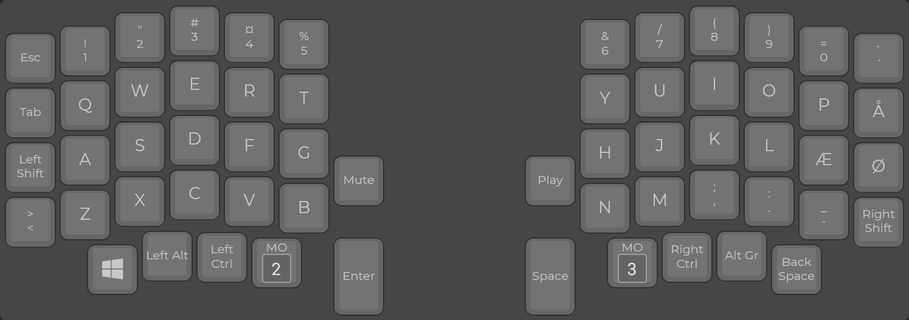

# Nordic keymap layout for Sofle Keyboard

Features:

- Various modes, can be switched (using Adjust layer and the selected one is stored in EEPROM.
- Modes for Qwerty and Colemak support (Nordic is qwerty only!)
- OLED is currently disabled
- Left encoder controls volume up/down/mute. Right encoder PGUP/PGDOWN and Play/Pause on toggle
